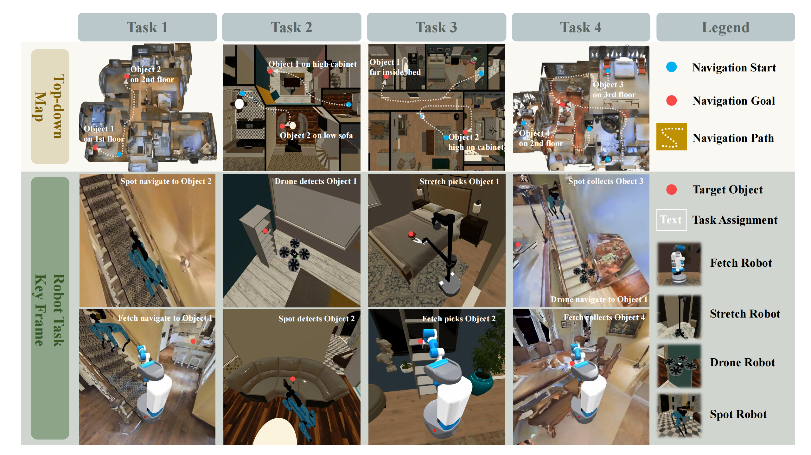
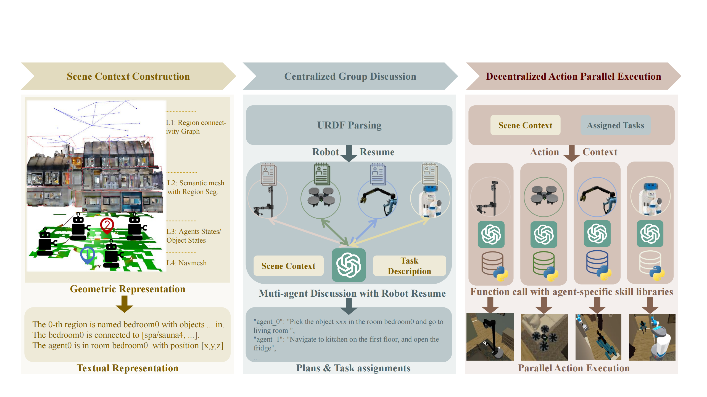

# EMOS

This repo maintains an overview of the Habitat-MAS benchmark and the EMOS multi-agent system, as introduced in paper [EMOS: Embodiment-aware Heterogeneous Multi-robot Operating System with LLM Agents](https://arxiv.org/pdf/2410.22662). Project page is to be released. 


<!-- <iframe width="1104" height="621" src="https://www.youtube.com/embed/icOXdZD4P70" title="EMOS: Embodiment-aware Heterogeneous Multi-robot Operating System with LLM Agents" frameborder="0" allow="accelerometer; autoplay; clipboard-write; encrypted-media; gyroscope; picture-in-picture; web-share" referrerpolicy="strict-origin-when-cross-origin" allowfullscreen></iframe> -->

**We are sorry that this is an early release of the project. We are still working on better clean-up and documentation. Please feel free to raise an issue if you have any questions or suggestions.**

## Table of Contents
- [Introduction](#introduction)
- [Installation](#installation)
    - [Install Habitat environment](#install-habitat-environment)
    - [Install Habitat-MAS extra dependencies](#install-habitat-mas-extra-dependencies)
- [Usage](#usage)
- [Other resources](#other-resources)
    - [Debugging an environment issue](#debugging-an-environment-issue)
    - [Documentation](#documentation)
    - [Questions?](#questions)
- [Credit](#credit)
    

## Introduction

**Habitat-MAS benchmark** is a highly configurable simulation platform designed for embodied AI challenges, based on the simulation platform [Habitat-lab 3.0](https://github.com/facebookresearch/habitat-lab) by Meta. It supports a wide range of indoor environment datasets, making it ideal for testing and developing multi-robot systems. The benchmark includes:



Datasets:
- Multi-floor real-scan scenes from Matterport3D (27 scenes)
- Single-floor synthesized scenes from HSSD (34 scenes)

Robot Types:
- Fetch: Wheeled base with a 7-degree-of-freedom (DOF) arm.
- Stretch: Wheeled base with a telescoping arm.
- Drone: DJI M100 equipped with an RGBD sensor.
- Spot: Legged base with a 7-DOF arm.

Tasks:
- Task 1: Cross-floor object navigation involving wheeled and legged robots.
- Task 2: Cooperative perception for manipulation, focusing on sensor-based collaboration.
- Task 3: Household rearrangement requiring manipulation capabilities.
- Task 4: Multi-floor, multi-agent, and multi-object rearrangement, testing comprehensive understanding and collaboration.

**EMOS (Embodiment-aware Multi-Agent Operating System)** is an innovative framework designed to enhance task planning and execution in heterogeneous multi-robot systems. 
Key features include:
- Embodiment-Aware Task Planning: Utilizes large language models (LLMs) to understand and plan tasks based on the physical capabilities of different robots.
- Robot Resume Concept: Instead of predefined roles, each robot generates a "resume" detailing its capabilities, which aids in task planning and execution.
- Hierarchical Task Management: The system performs task planning, assignment, and action execution through centralized group discussions followed by decentralized action execution.




<!-- ## Citing EMOS & Habitat-MAS

- [] TODO -->

## Installation

You should clone the our repo on the `embodied_mas` branch:

```bash
git clone https://github.com/SgtVincent/habitat-lab.git -b embodied_mas
```

### Install Habitat environment
Please follow the instructions in the [Install Habitat Environment](./install_habitat.md) to install the Habitat environment. Please refer to the Meta official repository [habitat-lab](https://github.com/facebookresearch/habitat-lab) for troubleshooting and more information.

### Install Habitat-MAS extra dependencies
Please follow the instructions in the [Habitat-MAS Installation](./habitat-mas/README.md#installation) to install the Habitat-MAS extra dependencies.

## Usage
Please also follow the instructions in the [Usage](./habitat-mas/README.md#usage) to run EMOS demo on Habitat-MAS benchmark.

## Other resources

### Debugging an environment issue

Our vectorized environments are very fast, but they are not very verbose. When using `VectorEnv` some errors may be silenced, resulting in process hanging or multiprocessing errors that are hard to interpret. We recommend setting the environment variable `HABITAT_ENV_DEBUG` to 1 when debugging (`export HABITAT_ENV_DEBUG=1`) as this will use the slower, but more verbose `ThreadedVectorEnv` class. Do not forget to reset `HABITAT_ENV_DEBUG` (`unset HABITAT_ENV_DEBUG`) when you are done debugging since `VectorEnv` is much faster than `ThreadedVectorEnv`.

### Documentation

Browse the online [Habitat-Lab documentation](https://aihabitat.org/docs/habitat-lab/index.html) and [Habitat-Lab Repository](https://github.com/facebookresearch/habitat-lab).


### Questions?
Can't find the answer to your question? Look up for [common issues](./TROUBLESHOOTING.md) or try asking the developers and community on our [Discussions forum](https://github.com/facebookresearch/habitat-lab/discussions).

## Credit
This repo is built upon the [Habitat Project](https://aihabitat.org/) and [Habitat Lab](https://github.com/facebookresearch/habitat-lab) by Meta.
We would like to thank the authors of the original Habitat project for their contributions to the community.